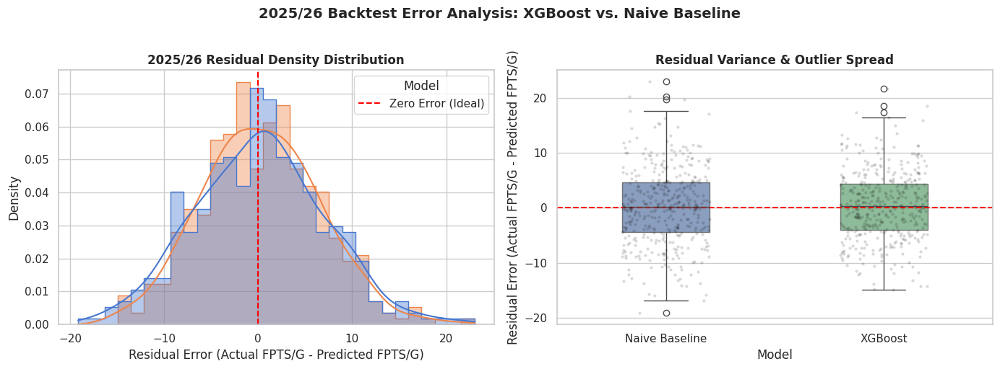
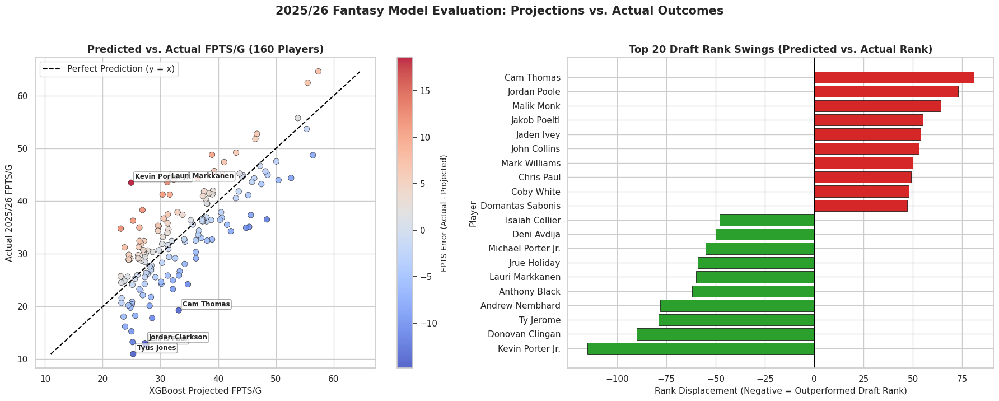

# 🏀 NBA Fantasy 2026/27 Draft Board & Projection Engine

An end-to-end quantitative machine learning pipeline built to forecast season-long Fantasy Points Per Game (FPTS/G), calculate positional Value Over Replacement Player (VORP), and generate automated, tier-grouped draft sheets for **16-team ESPN Fantasy Basketball** leagues.

---

## 📌 Project Overview
- **Data Engine**: Parses and processes multi-year player-level game logs using `pandas` and `pyarrow`.
- **Feature Engineering**: Constructs 1-, 2-, and 3-year lagged performance features ($t, t-1, t-2$) capturing per-minute efficiency (`fpts_per_min`), volume trends, usage, and shooting metrics.
- **Predictive Model**: Trains a tuned `XGBRegressor` to project next-season per-game fantasy scoring.
- **16-Team VORP & Clustering**: Establishes positional replacement baselines across 160 starter slots and applies $k$-Means clustering to form statistical draft tiers.
- **Interactive Excel Sheet**: Exports a styled `.xlsx` draft board (`openpyxl`) featuring tier gradient fills, number formatting, and live draft checking (`Drafted?` column).

---

## 📊 Data Source
The underlying player-level game log dataset is sourced from Kaggle:
- **Dataset:** [NBA Stats Dataset](https://www.kaggle.com/datasets/chevronronson/nba-stats-dataset?resource=download-directory) by Chevron Ronson.
- **Coverage:** Historical player-level box scores aggregated into seasonal lag matrices (`master_player_level.parquet`).

---

## 📈 Model Evaluation & Backtest Analysis

The model was rigorously backtested against the **2025/26 NBA season** by training strictly on prior historical data and comparing predicted draft board outcomes against actual player performance.

### 1. Residual Error Distribution
Comparing the XGBoost regressor against a naive **Last Season Baseline** (assuming a player simply repeats their prior season's FPTS/G):



* **Variance Reduction:** XGBoost significantly tightens the interquartile range (IQR) of prediction errors, mitigating severe misprojections caused by single-season performance spikes.
* **Peak Precision:** The residual density distribution peaks sharply around zero error, demonstrating superior calibration across mid-round draft picks.

### 2. Projections vs. Actual Outcomes (160 Starter Board)
Evaluating the top 160 draftable choices in a 16-team format:



* **Linear Alignment:** The scatter plot demonstrates strong alignment along the ideal $y = x$ reference line.
* **Draft Displacement Tracking:** Captures significant draft-rank outliers (e.g., identifying breakout value in players who outperformed draft rank vs. identifying regression candidates).

---

## ⚙️ League Scoring Context (ESPN Standard)

| Stat | ESPN FPTS Multiplier |
| :--- | :--- |
| Points (`PTS`) | **+1.0** |
| Rebounds (`REB`) | **+1.0** |
| Assists (`AST`) | **+2.0** |
| Steals (`STL`) | **+4.0** |
| Blocks (`BLK`) | **+4.0** |
| Turnovers (`TOV`) | **-2.0** |
| 3-Pointers Made (`3PM`) | **+1.0** |

* **League Format:** 16 Teams | 10 Starters per Team (160 Total Starters across PG, SG, SF, PF, C, and UTIL).

---

## 🛠️ Installation & Execution

### 1. Clone & Set Up Environment
```bash
git clone [https://github.com/samso05/NBA-Fantasy-2026-27-Prediction.git](https://github.com/samso05/NBA-Fantasy-2026-27-Prediction.git)
cd NBA-Fantasy-2026-27-Prediction

python -m venv venv
source venv/bin/activate  # On Windows use: venv\Scripts\activate
pip install -r requirements.txt
